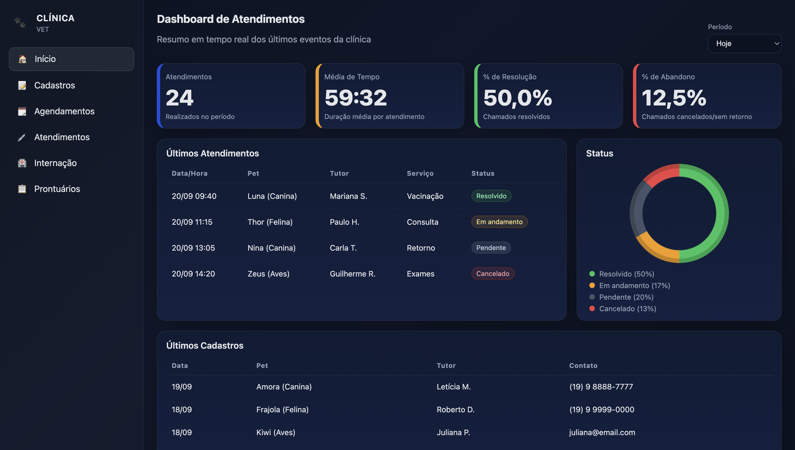

# Sistema de Gestão para Clínicas Veterinárias  
**SCC0219 - Introdução ao Desenvolvimento Web**  
Profa. Dra. Bruna Carolina Rodrigues da Cunha  
Primeira entrega: 15/09/2025  

## 👥 Membros
- Guilherme Augusto Fincatti da Silva — 13676986  
- Marco Antonio Gaspar Garcia — 11833581  
- Pedro Guilherme de Barros Zenatte — 13676919  

Alunos de Engenharia de Computação da USP São Carlos.  

| [ Guilherme Fincatti](https://github.com/GuilhermeFincatti) | [ Marco Garcia](https://github.com/marcogarcia2) | [ Pedro Zenatte](https://github.com/pedrozenatte) |
| :---: | :---: | :---: |  

---

## 📌 Descrição
A ideia central é fornecer um **site gratuito** de organização e gerenciamento para veterinários e clínicas veterinárias.  
O sistema visa **facilitar a gestão de cadastros, atendimentos, internações e prontuários**, além de **organizar agendamentos** e fornecer **relatórios em tempo real**.  

---

## ⚙️ Requisitos  
Com base na conversa com a cliente, levantamos os seguintes requisitos iniciais:  

### Funcionais
- [ ] Cadastro de animais e tutores.  
- [ ] Agendamento de consultas e procedimentos.  
- [ ] Registro de atendimentos realizados.  
- [ ] Gerenciamento de internações.  
- [ ] Emissão e consulta de prontuários.  
- [ ] Painel de indicadores (número de atendimentos, tempo médio, status etc.).  

### Não Funcionais
- [ ] Interface responsiva para desktop e mobile.  
- [ ] Navegação simples e intuitiva.  

---

## 🛠️ Tecnologias Utilizadas
- **HTML5** e **CSS3** → estrutura e estilo.  
- **JavaScript (ES6+)** → interatividade e lógica.  
- **Git & GitHub** → versionamento e colaboração.  

---

## 🚀 Próximos Passos
- Modularizar componentes repetidos (barra lateral, cabeçalho, rodapé).  
- Implementar funcionalidades com **JavaScript**:  
  - Validação de formulários.  
  - Listagem dinâmica de dados.  
  - Filtros de pesquisa e ordenação.  
- Iniciar a integração com dados **mockados em JSON**.  
- Desenvolver protótipo inicial do **painel interativo** com gráficos.  

---

## 📸 Protótipo
  
